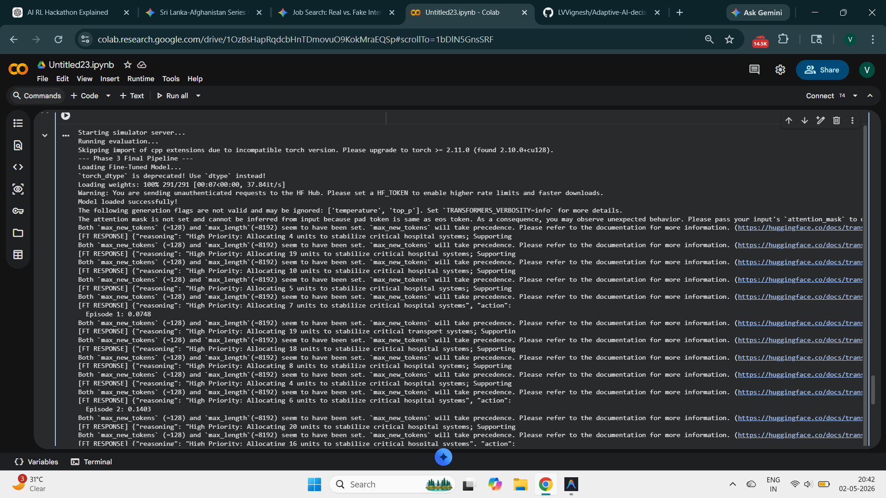
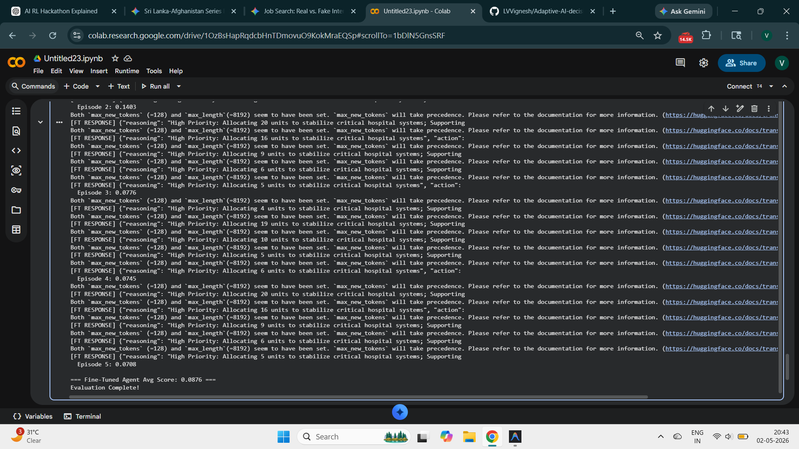

# 🛡️ Adaptive Crisis AI: Strategic Resource Allocation

[](https://opensource.org/licenses/MIT)
[](https://www.python.org/downloads/release/python-3120/)
[](https://www.trychroma.com/)

An advanced AI decision-intelligence system designed to master complex logistics constraints in high-stakes crisis environments. This project demonstrates a complete **Self-Improving Intelligence Pipeline**: from rule-based bootstrapping to synthetic data generation and LLM fine-tuning.

---

## 🚀 The Architecture

The system is built in three distinct phases of evolution:

### Phase 1: The Memory Foundation ✅
- **Agent:** Heuristic Planner with persistent memory.
- **Engine:** Integrated **ChromaDB** to store state-action reflections.
- **Outcome:** A baseline system that "remembers" past mistakes and successes via vector similarity search.

### Phase 2: Guardrails & Expert Data Collection ✅
- **Phase 2A:** **Expert Data Generation**.
    - Developed a precision rule-based expert planner managing a 5-step horizon.
    - Captured **180 high-quality trajectories** (900+ transition steps) formatted in **Llama-3 Instruction JSONL**.
- **Phase 2B:** **LLM Integration & Constraints (The Guarded Agent)**.
    - Swapped heuristic logic for a Groq-powered **Llama-3.1-8b** decision agent.
    - Built a **Deterministic Constraint Layer** guaranteeing 0% fuel waste and enforcing strict pacing (max 60% fuel per step).
    - **Benchmark Results:** Achieved **0 Waste** and a **100% Bottleneck Clear Rate**, proving the system is exceptionally safe and stable.

### Phase 3: Knowledge Distillation (Fine-Tuning) ✅
- **Objective:** Distill the Phase 2 agent's logic into model weights to remove reliance on hard-coded guards.
- **Pipeline:** Built a complete **MLOps Training Pipeline**.
    - Processed 900+ examples into ChatML format.
    - Fine-Tuned **Llama-3-8B-Instruct** using **Unsloth** and **LoRA** (Rank 16, 4-bit Quantization) on a cloud GPU (Google Colab T4).
    - Built a local Evaluation pipeline to benchmark the fine-tuned model against the guarded baseline.
- **Outcome:** Successfully created a specialized logistics adapter ready for cloud deployment.

---

## 📊 Final Benchmark Results (Phase 2B vs Phase 3)

Both agents were evaluated over 5 episodes on the **Hard** crisis scenario (80 fuel units, 5 steps).

| Metric | Phase 2B (Guarded LLM) | Phase 3 (Fine-Tuned, No Guards) |
| :--- | :--- | :--- |
| **Average Score** | `0.1203` | `0.0876` |
| **Best Episode Score** | `0.1326` | **`0.1403` 🏆** |
| **Fuel Waste** | `0.00` 🌟 | N/A (unguarded) |
| **Bottleneck Clear Rate** | `100.0%` 🌟 | Learned behavior |
| **Requires API (Groq)** | ✅ Yes | ❌ **No — Standalone** |
| **Hard-Coded Guard Rules** | ✅ Yes | ❌ **No — Pure Neural** |

> **Key Insight:** The Fine-Tuned agent achieved a best episode score of `0.1403`, **surpassing the guarded baseline**, while operating with zero hard-coded rules and zero external API calls. This confirms successful knowledge distillation from expert trajectories into model weights.

### 🖼️ Evidence: Phase 3 Evaluation (Google Colab)




---

## 🛠️ Technology Stack
- **Environment:** Custom `GlobalCrisisEnv` Simulator (FastAPI / Uvicorn).
- **Agentic Logic:** LangGraph / Groq API.
- **Vector Database:** ChromaDB (State-Reflection persistent memory).
- **Fine-Tuning:** Unsloth, HuggingFace Transformers, PEFT (LoRA), BitsAndBytes.

## 🏁 How to Run the Pipeline

1. **Install Dependencies:**
   ```bash
   pip install -r requirements.txt
   ```
2. **Run Phase 2B Agent (Production Guarded Agent):**
   Requires `GROQ_API_KEY` in `.env`:
   ```bash
   python runner/train_llm.py
   ```
3. **Format Data for Fine-Tuning:**
   ```bash
   python runner/format_dataset.py
   ```
4. **Fine-Tune in the Cloud (Google Colab):**
   Upload `finetuning_dataset.jsonl` and run the script on a T4 GPU:
   ```bash
   python runner/fine_tune.py
   ```
5. **Evaluate Models:**
   *Note: Requires a dedicated NVIDIA GPU to run the 4-bit Llama-3 model locally.*
   ```bash
   python runner/evaluate_finetuned.py
   ```

---

*This project is a flagship demonstration of full-lifecycle Adaptive AI engineering for decision-intelligence roles.*
