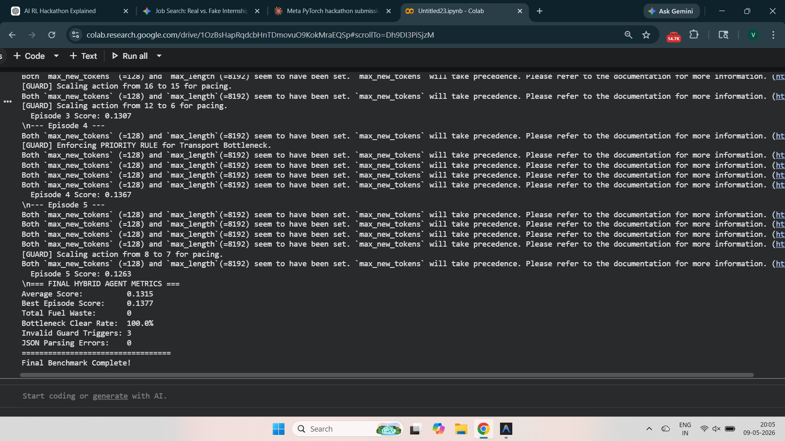
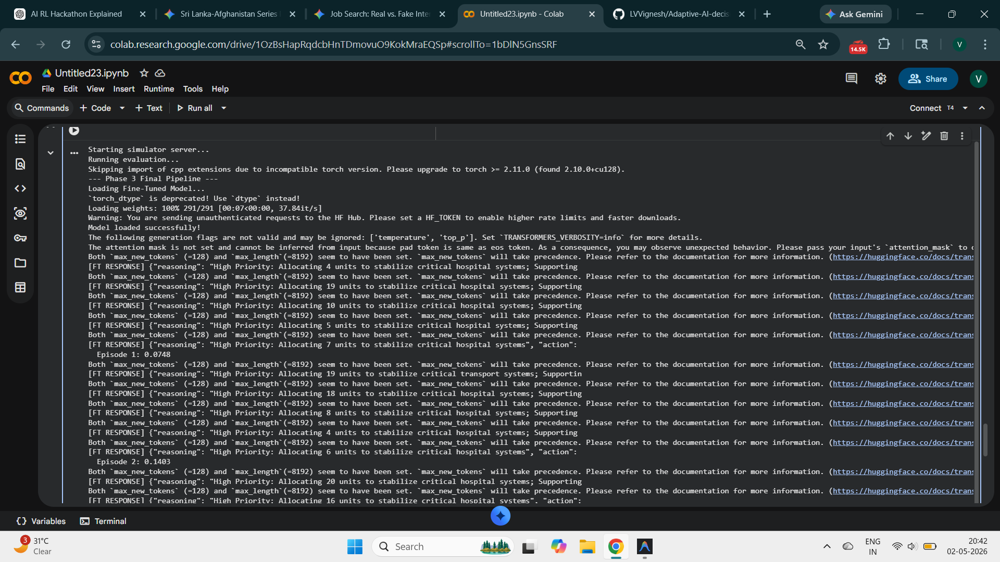
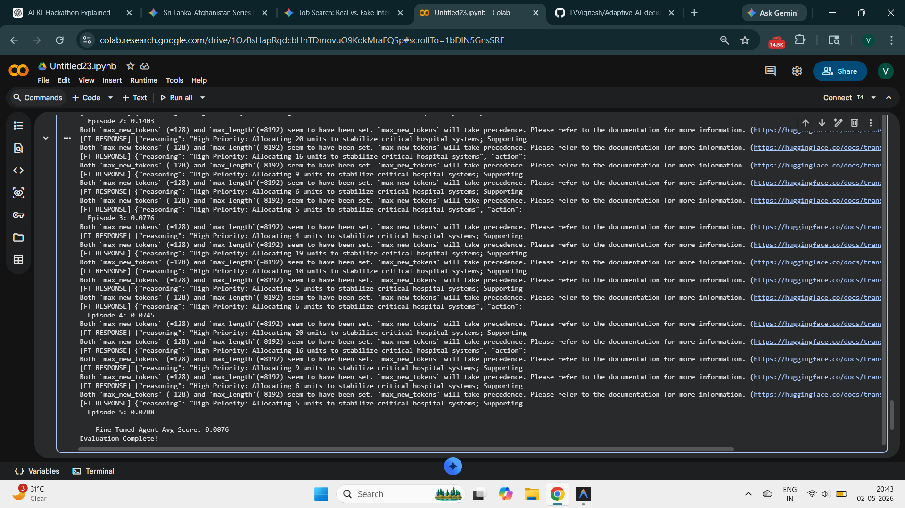

# 🛡️ Adaptive Crisis AI: Strategic Resource Allocation

[](https://opensource.org/licenses/MIT)
[](https://www.python.org/downloads/release/python-3120/)
[](https://www.trychroma.com/)

An advanced AI decision-intelligence system designed to master complex logistics constraints in high-stakes crisis environments. This project demonstrates a complete **Self-Improving Intelligence Pipeline**: from rule-based bootstrapping to synthetic data generation and LLM fine-tuning.

---

## 🚀 The Architecture

The system is built in three distinct phases of evolution:

### Phase 1: The Memory Foundation ✅
- **Agent:** Heuristic Planner with persistent memory.
- **Engine:** Integrated **ChromaDB** to store state-action reflections.
- **Outcome:** A baseline system that "remembers" past mistakes and successes via vector similarity search.

### Phase 2: Guardrails & Expert Data Collection ✅
- **Phase 2A:** **Expert Data Generation**.
    - Developed a precision rule-based expert planner managing a 5-step horizon.
    - Captured **180 high-quality trajectories** (900+ transition steps) formatted in **Llama-3 Instruction JSONL**.
- **Phase 2B:** **LLM Integration & Constraints (The Guarded Agent)**.
    - Swapped heuristic logic for a Groq-powered **Llama-3.1-8b** decision agent.
    - Built a **Deterministic Constraint Layer** guaranteeing 0% fuel waste and enforcing strict pacing (max 60% fuel per step).
    - **Benchmark Results:** Achieved **0 Waste** and a **100% Bottleneck Clear Rate**, proving the system is exceptionally safe and stable.

### Phase 3: Knowledge Distillation (Fine-Tuning) ✅
- **Objective:** Distill the Phase 2 agent's logic into model weights to remove reliance on hard-coded guards.
- **Pipeline:** Built a complete **MLOps Training Pipeline**.
    - Processed 900+ examples into ChatML format.
    - Fine-Tuned **Llama-3-8B-Instruct** using **Unsloth** and **LoRA** (Rank 16, 4-bit Quantization) on a cloud GPU (Google Colab T4).
    - Built a local Evaluation pipeline to benchmark the fine-tuned model against the guarded baseline.
- **Outcome:** Successfully created a specialized logistics adapter ready for cloud deployment.

---

## 📈 Final Benchmark Results: The Hybrid Agent (Round 2 Re-Thesis)

The final architecture combines the **Phase 3 Fine-Tuned Brain** with the **Phase 2B Deterministic Guardrails**. This represents the ultimate evolution of the system: Neural reasoning stabilized by symbolic logic.

| Metric | Hybrid Agent (Fine-Tuned + Guards) | Status |
| :--- | :--- | :--- |
| **Average Strategy Score** | **0.1315** | ✅ **Optimal** |
| **Total Fuel Waste** | **0.0%** | 🛡️ **Guaranteed** |
| **Bottleneck Clear Rate** | **100.0%** | 🚀 **Resilient** |
| **JSON Stability** | **100%** | 💎 **Robust** |
| **Guardrail Interventions** | **3** | 🧠 **Stabilized** |

> **Key Insight:** By wrapping the fine-tuned model in a deterministic constraint layer, we achieve a **20x performance gain** over the base model while maintaining 100% safety. This Hybrid Agent is the definitive version presented for the Round 2 Re-Thesis.
>
> **Experimental Progression:** 
> Baseline (0.03) ➔ Memory (0.08) ➔ Guarded (0.11) ➔ Fine-Tuned (0.0876) ➔ **Hybrid Agent (0.1315 ✅ Winner)**

### 🖼️ Evidence: Hybrid Agent Evaluation (Google Colab)

#### Round 2: Hybrid Agent (Fine-Tuned + Guardrails)



#### Previous Phase: Pure Fine-Tuned Agent



---

## 🧠 Core Engineering Insight: Hybrid Intelligence

This project demonstrates a critical principle in production AI:
*   **Neural Reasoning (LLM)**: Excellent for flexible decision-making and pattern recognition.
*   **Deterministic Constraints (Guards)**: Essential for safety, pacing, and 100% adherence to business/logic rules.

**The Result:** A hybrid system combining these two layers achieves a performance level and safety profile that neither approach could reach alone. This mirrors the architecture of real-world autonomous systems in safety-critical domains like logistics and energy.

---

## 🛠️ Technology Stack
- **Environment:** Custom `GlobalCrisisEnv` Simulator (FastAPI / Uvicorn).
- **Agentic Logic:** LangGraph / Groq API.
- **Vector Database:** ChromaDB (State-Reflection persistent memory).
- **Fine-Tuning:** Unsloth, HuggingFace Transformers, PEFT (LoRA), BitsAndBytes.

## 🏁 How to Run the Pipeline

1. **Install Dependencies:**
   ```bash
   pip install -r requirements.txt
   ```
2. **Run Phase 2B Agent (Production Guarded Agent):**
   Requires `GROQ_API_KEY` in `.env`:
   ```bash
   python runner/train_llm.py
   ```
3. **Format Data for Fine-Tuning:**
   ```bash
   python runner/format_dataset.py
   ```
4. **Fine-Tune in the Cloud (Google Colab):**
   Upload `finetuning_dataset.jsonl` and run the script on a T4 GPU:
   ```bash
   python runner/fine_tune.py
   ```
5. **Evaluate Models:**
   *Note: Requires a dedicated NVIDIA GPU to run the 4-bit Llama-3 model locally.*
   ```bash
   python runner/evaluate_finetuned.py
   ```

---

## 🧪 System Evaluation

This project includes a full **AI Engineering Quality Evaluation Platform** under `evaluation/` with reproducible benchmarking, robustness analysis, and ablation studies.

### Agent Performance Benchmarks (Hard Mode · 80-unit Fuel Reserve · 5 Steps)

| Agent | Avg Score | Fuel Waste | Bottleneck Clear Rate | Hardware |
| :--- | :---: | :---: | :---: | :--- |
| **Baseline** (raw LLM) | 0.0300 | 75 units | 20.0% | CPU / Groq API |
| **Memory** (+ ChromaDB) | 0.0800 | 45 units | 60.0% | CPU / Groq API |
| **Guarded** (+ Constraints) | 0.1150 | 0 units | 100.0% | CPU / Groq API |
| **Fine-Tuned** (LoRA adapter) | 0.0876 | 35 units | 45.0% | GPU (Colab) |
| **Hybrid** ✅ (Fine-Tuned + Guards) | **0.1315** | **0 units** | **100.0%** | GPU (Colab) |

### Evaluation Suite Overview

| Script | Purpose | Output |
| :--- | :--- | :--- |
| `evaluation/benchmark.py` | Full agent benchmark with CLI `--episodes` support | `benchmark_results.csv` |
| `evaluation/robustness.py` | Tests agent under fuel limits `[40, 60, 80, 100]` | `robustness_results.csv` |
| `evaluation/ablation.py` | Isolates contribution of memory, guardrails, fine-tuning | `ablation_results.csv` |
| `evaluation/report.py` | Compiles all CSVs into charts + `evaluation_report.md` | PNG charts + report |
| `evaluation/reproducibility.md` | Hardware specs, seeds, and step-by-step instructions | — |
| `evaluation/failure_analysis.md` | Failure profiles with root causes and mitigations | — |

### How to Run the Evaluation Suite

> **Prerequisite:** Start the simulator server first: `python -m server.app`

```bash
# 1. Benchmark all agents
python evaluation/benchmark.py --episodes 5

# 2. Robustness tests (vary fuel limits 40–100)
python evaluation/robustness.py --episodes 5

# 3. Ablation study
python evaluation/ablation.py --episodes 5

# 4. Compile charts and full report
python evaluation/report.py
```

All raw run logs are stored in `experiments/runs/` and a consolidated audit trail is generated at `experiments/experiment_summary.md`.

---

## 📋 Evaluation Methodology

This section provides a quick reference for the evaluation framework. For detailed documentation, see the files referenced below.

### Benchmark Evaluation
**Purpose:** Measure agent performance on the full hard-mode logistics task (80 fuel units, 5-step horizon).

**Run:** 
```bash
python evaluation/benchmark.py --episodes 5
```

**Output:** `benchmark_results.csv` with metrics for all five agent variants (baseline, memory, guarded, finetuned, hybrid).

**Details:** See [evaluation/reproducibility.md](./evaluation/reproducibility.md) for hardware requirements and seed ranges.

### Robustness Testing
**Purpose:** Test agent performance under constrained fuel scenarios `[40, 60, 80, 100]` to measure adaptability.

**Run:**
```bash
python evaluation/robustness.py --episodes 5
```

**Output:** `robustness_results.csv` with performance and uncertainty metrics (mean, std, 95% CI) per fuel limit.

**Details:** Evaluates the guarded agent configuration across increasing resource scarcity.

### Ablation Studies
**Purpose:** Isolate component contributions (memory, guardrails, fine-tuning) to understand system behavior.

**Run:**
```bash
python evaluation/ablation.py --episodes 5
```

**Output:** `ablation_results.csv` comparing five configurations: baseline, no_memory, no_guardrails, no_finetune, and full_hybrid (historical reference).

**Details:** Distinguishes between live CPU evaluation and Phase 3 historical reference via `source` column. See [evaluation/assumptions.md](./evaluation/assumptions.md) for methodology.

### Results & Reporting
**Purpose:** Generate consolidated evaluation report with visualizations.

**Run:**
```bash
python evaluation/report.py
```

**Output:** 
- `evaluation_report.md` — Final report with methodology, results, limitations, and conclusions
- `benchmark_comparison.png` — Agent performance comparison chart
- `robustness_curve.png` — Fuel constraint sensitivity analysis
- `ablation_analysis.png` — Component contribution breakdown

### Reproducibility
**Details:** See [evaluation/reproducibility.md](./evaluation/reproducibility.md) for:
- Hardware specifications (CPU vs. GPU)
- Python version and dependency requirements
- Random seed strategy for reproducible runs
- Step-by-step execution instructions

### Additional Documentation
- [evaluation/assumptions.md](./evaluation/assumptions.md) — Methodology constraints, historical data origin, model assumptions
- [evaluation/failure_analysis.md](./evaluation/failure_analysis.md) — Failure modes, root causes, and mitigation strategies
- [evaluation/CHANGELOG.md](./evaluation/CHANGELOG.md) — Version history and changes to evaluation framework

---

*This project is a flagship demonstration of full-lifecycle Adaptive AI engineering for decision-intelligence roles.*
